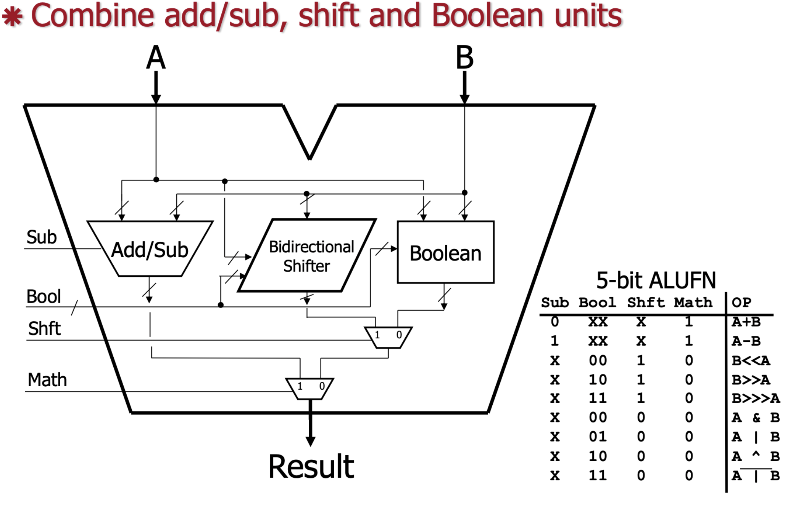

# Lab 06
In this lab, we will model the ALU discussed in class and implement all of its functionality! At a high level, a ALU consists of an adder, a shifter, a logic circuit, and two multiplexers. But with the help of wires and control flags, all the pieces can be put together into a cohesive unit that performs our favorite arithmetic and logical operations. The general structure for all the pieces has been provided to you; it is up to you to implement their control flag logic and actual behavior so that they work like a real ALU.

### Reading
* [Common Digital Logic Circuits: Arithmetic, Shift, Boolean, and Multiplex slides](https://sakai.unc.edu/access/content/group/167842e9-e6e0-4d16-81bd-842fcf59831e/Lecture%20Slides/11_2_21.pdf)

### File Structure
Three files are included in this lab: 
* `lab06.c` - This is the driver code that you can use to test your code. It takes inputs for the circuits from stdin and prints the output. **Please do not modify.**
* `alu.h` - This header contains definitions of all the structs used in this lab (`arithmetic`, `shift`, `logic`, and `mux`) and their accompanying functions. Implementation of these functions is your main task for the lab. **Please do not modify.**
* `alu.c` - Implementations of undefined functions in `alu.h` belong in this section. This is the only file that should be edited.

### Honor Code Header
Please include the honor code header at the top of the `alu.c` file.  Since we do grade manually for style we do not include names on code listings to avoid biasing the grading.
```c
// PID: 9DigitPidNoSpacesOrDashes
// I pledge the COMP 211 honor code.
```

## A Note on ALUs
The goal of this lab is to simulate an ALU, similar to how Lab 05 simulated a cache. However, ALUs are hardware components made up of wires and circuits that implement logical functions, and there are many important distinctions between what a real ALU does and how we can simulate it with C code. 

In a real ALU, the inputs are electrical signals and the output is merely a combination of the inputs (as voltages) that have traversed through some circuits. In this lab, you will implement a `configure_alu` and `run_alu` function. The configuration function sets the appropriate ALUFN control signals and the `run_alu` function returns the output of the ALU with A and B as parameters. In a real ALU, the ALUFN bits, A, and B would all be given as "inputs" simultaneously, but this simultaneity will not be a concern for this lab.

## Part 0: Problem Overview
The following is a picture of the ALU discussed in class, illustrating that the ALU is actually composed of four types of logical units, each of which contains two 32-bit inputs, some Boolean control flag inputs (i.e. `Sub`, `Bool`, `Shft`, and `Math`), and an output. The overall output of the ALU is determined by the particular values of each control flag, and all valid combinations of control flag inputs are shown in the table on the bottom right.



Each of the four units has a corresponding struct defined in `alu.h`. For example, for the Add/Sub unit in the diagram, the corresponding struct is:
```c
typedef struct {
	int A;					// 32 bit input
	int B;					// 32 bit input
	int Y;					// 32 bit output
	char Sub;				// ALUFN: Sub = 0 or 1
} arithmetic;
```

Each struct has A and B as inputs, Y as the output, a field for the relevant control flag (i.e. `Sub`).

Also note the nearby declarations of the following functions:
```c
void arithmetic_fun_exe(arithmetic* circuit);
int arithmetic_fun_cfg(arithmetic* circuit);
```

These declarations are associated with the actual function definitions, which are to be implemented in `alu.c`. 

Read carefully through the definition of each struct and understand how they relate to the diagram before proceeding.

## Part 1: Completing the Circuits
Your task for Part 1 is to complete all of the unimplemented "`exe`" functions: namely, `arithmetic_fun_exe`, `shift_fun_exe`, `logic_fun_exe`, and `mux_fun_exe`. Note that all of the `cfg` functions are already complete; all they do is validate inputs for a particular struct, returning `OK` if all inputs are valid and `CONFIG_ERROR` otherwise.

The behavior of each circuit when provided certain control flags is shown in the diagram in Part 0. All control flags are represented as characters, and each flag may only take the value `0` or `1` (except for `Bool`, which is represented as a string with 2 of these values and a null terminator).

Each `exe` function expects an argument `circuit` which has already been initialized (all fields except the output of the `circuit`'s struct have been initialized). In each `exe` function, you need to implement the expected behavior of the circuit, given the inputs provided from the `circuit` struct and then set `circuit->Y` to the result.

This simulates the "execution" of a circuit given certain inputs and control flags. 

#### Example
Suppose we have a pointer to an `arithmetic` struct named `circuit` with fields initialized to the following values:
```c
arithmetic *circuit = malloc(sizeof(arithmetic));
arithmetic->A = 0x00000010;
arithmetic->B = 0x00000020;
arithmetic->Sub = '1';
```

Note that every field has an initialized value except for Y. To "use" the arithmetic circuit, we configure and execute it as follows:
```c
arithmetic_fun_cfg(circuit); // This will return `CONFIG_ERROR` or `OK`
arithmetic_fun_exe(circuit); // This will actually execute the circuit
```

Since the `Sub` flag is set to `'1'`, we must perform the operation `A - B`, as according to the ALUFN flag table:
```c
arithmetic->Y = arithmetic->A - arithmetic->B; // 0x00000010 - 0x00000020
```
Note that the only difference between this and the original state is that Y is now set to the sum of A and B. Getting Y to be the correct value for each combination of control flags is all you have to do for each `exe` function.

**Note**: Do not worry about implementing both right shift logical (>>) and right shift arithmetic (>>>). For these operations, you can simply use the `>>` operator.

### Testing
In `lab06.c`, note that the main function simply contains a call to `part1_test`. Read this function carefully to understand its behavior. In the directory `part1_tests`, there will be sample inputs and outputs for various executions of various circuits. Like in previous labs, you will be able to `diff` the expected output with your result to determine whether your code is correct.

#### Using the ALU
To "use" the ALU, type `make` to compile the lab, then execute the `lab06` executable file. You can also do `make run`. This will run the driver code from `lab06.c`. It will ask you for the 5 bit ALUFN, the 32 bit hex values for A and B and an ALU component to use, then it will give you the output from the component given those inputs.

## Part 2: Putting the ALU Together
Now that all of the pieces are in functioning, it's time to put them together! 

Each circuit in the diagram of Part 0 is instantiated as a global variable in `alu.h`:
```c
mux* math_mux;
mux* shft_mux;
shift* shift_circuit;
logic* logic_circuit;
arithmetic* arithmetic_circuit;
```
For part 2, complete the `configure_alu` and `run_alu` functions in `alu.c`. When `configure_alu` and `run_alu` are called one after another, it is analogous to connecting all the ALUFN wires to their component parts and then connecting the wires for each bit in `A` and each bit in `B` and having the correct value finally flow through to the output `Y`.

`configure_alu` sets the control flags of every circuit to the user-supplied value. The return value should be `CONFIG_ERROR` (`1`) if there was an error (incorrect input), or `OK` (`0`), if everything was configured correctly. It should use each circuit's `cfc` function for validation, which also each return either `OK` or `CONFIG_ERROR`.

`run_alu` performs the desired operation on `A` and `B` based on the supplied control flags that were set in `configure_alu` and returns the result of the computation. Note that you shouldn't use any logic (like `if` statements, math, `&`s, `|`s) in `run_alu`. You must properly configure set of the fields of each circuit, then execute them using the dataflow in the diagram and return the correct output. 

For example, given the following inputs to the program:
```
A = 0x00000010
B = 0x00000020
Sub = 0
Bool = 00
Shft = 0
Math = 1
```
The result returned by `run_alu` would be 0x0000030.

### Testing
Testing is identical to Part 1. Simply comment out the line calling `part1_test` and uncomment the line calling `part2_test`. The corresponding tests are in the directory `part2_tests`.

## Submit the Assignment
1. Use git to push your finished code to this GitHub repository.
2. Go to the COMP 211 course in GradeScope and click on the assignment called **Lab 06**.
3. Click on the option to **Submit Assignment** and choose GitHub as the submission method.
4. You should see a list of your public repositories. Select the one named **lab-06-yourname** and submit it.
5. Your assignment should be autograded within a few seconds and you will receive feedback for the autograded portion.
6. If you receive all the points, then you have completed this lab! Otherwise, you are free to keep pushing commits to your GitHub repository and submit for regrading up until the deadline of the lab.

## Grading
### Autograder tests (8 pts)
Remember, you can submit as many times as you like before the due date to get full credit.

### Style (2pts)
* Variable Names (.5 pts)
	* Single-character variable names are only used for counting/indexing, or when used to represent a variable whose type has only one instance.
	* All "magic numbers" are defined as constants.
	* Variable names are either related to the usage of the variable, or the meaning is commented.
	* No unused variables are declared.
* Readability (.75 pts)
	* Proper indentation (use the following Vim trick: (1G=G) )
	* Consistent whitespace theme used throughout.
	* Logically distinct blocks of code are separated by whitespace.
	* No more than two consecutive lines of empty whitespace.
	* No old debug code is present (including in the comments).
* Correctness of Code (.75 pts)
	* For all functions (including main if applicable), every path of execution leads to a return statement.
	* No libraries are included that weren't provided in the starter code or mentioned in the README.

We reserve the right to deduct points from the autograder if we notice that you have hardcoded any test cases and not actually fully implemented the functions. For `run_alu`, only set circuit components and run their "`exe`" functions; no C logic should be used (i.e. no `if`s, no boolean logic, no +, -, etc) for this function.
